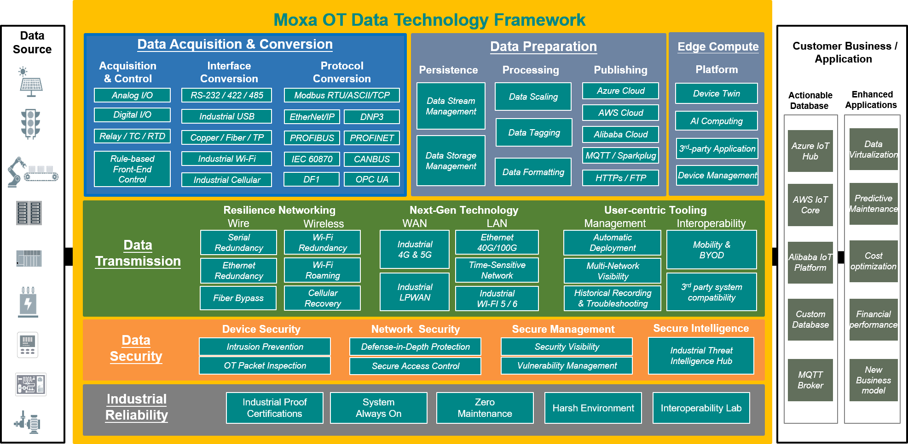
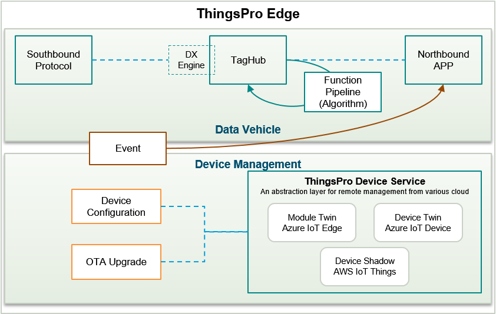
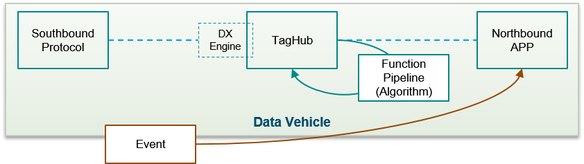
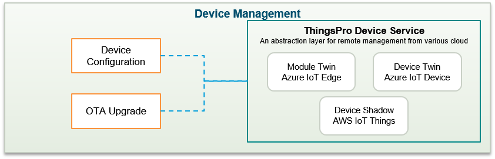

# What Is ThingsPro Edge V2.2.1?
**ThingsPro Edge** is an **IIoT edge gateway software** that runs on Moxa IIoT Gateways (Moxa's industrial-grade edge computers) enabling you to close the gap between sensors and cloud applications. The containerized software architecture of ThingsPro Edge brings an extensible runtime experience with secure and reliable life-cycle management to functional modules. 

**ThingsPro Edge** offers an easy-to-use user interface to: acquire data from sensors and other field devices, manipulate or filter data locally before sending it out to your applications, and secure data transmission during uploads to popular cloud platforms or your application/database. With the built-in RESTful API, integrating these capabilities into your system is more straightforward than ever.

# System Architecture
See how ThingsPro Edge can fit into your sensor-to-cloud IIoT solution and help simplify the design and development.

# What does ThingsPro Edge offer?

ThingsPro Edge is designed to enable the global IIoT businesses by offering an integrated solution to make them successful. Nowadays, the most challenging step for digital transformation is how to connect to the IT field without breaking the existing OT network. In association with system integrators (SIs) and independent software vendors (ISVs), Moxa can help enterprises conquer the complexities by offering a simplified, secure, and reliable OT data transportation solution. The following illustration shows how ThingsPro Edge works on top of the Moxa Edge computing platform to play an essential role in secure and robust **Data Ingestion**, **Processing**, and **Transmission** .

- **Intuitive Web GUI**

ThingsPro Edge is configured and managed using standard web technologies. You no longer need to use a command line interface to configure Modbus settings for device connections or Azure connection strings and certificates. You can use the intuitive web GUI to connect and configure the network and system settings of your IIoT gateways, create device tags, and monitor the runtime status, all from a computer on the network.

- **Integration with the Azure IoT Hub**

In addition to managing Moxa's IIoT Gateways from ThingsPro Edge's Web GUI, you can now configure, monitor, and control these Gateways from the Azure portal. <u>ThingsPro Edge Device Service</u> integrates device twins, direct methods, and device-to-cloud messages into ThingsPro Edge to realize seamless remote monitoring and control from the cloud.

- **Streamlined sensor-to-cloud data transportation**

With ThingsPro Edge, transporting your data from the assets at the edge to your business has never been easier! If you are building a cloud application, the Modbus and other OT protocol applications help you acquire data from your edge devices. You can then use Azure or other cloud connectivity applications to publish the taged data to the cloud where you can build you applications. 

- **Custom payload**

ThingsPro Edge makes it easy to publish acquired data to your applications and systems. You no longer require to develop programs to manipulate the message format to suit your applications or systems. ThingsPro Edge helps you manipulate data without requiring any programming skills.

- **Rapid development**

ThingsPro Edge is designed for rapid development so that you can quickly create software applications for autonomous data processing, and event-triggered actions or alarms.

- **Secure design**

ThingsPro Edge helps you maintain the integrity of data during transmission and processing. The SecureBoot function and a built-in Trusted Platform Module (TPM) offer strong protection for your device.

- **Robust OTA upgrade**

Keeping the software and firmware on your device up-to-date can effectively help prevent cyberattacks. However, updating devices located in remote unmanned sites is a big challenge for most administrators. ThingsPro Edge's Robust over-the-air (OTA) updates cover both software application and the device firmware upgrades. The resume capability ensures that you can get the upgrade pack even with intermittent cellular connectivity and the roll-back mechanism will recover your system from a failed installation.

In a nutshell, the dual-track architecture represents the core values of ThingsPro Edge.

- The **Data Vehicle** component offers the capabilities to transport the OT data any time, anywhere, and when you need it.
- The **Device Management** component simplifies remote monitoring and control of your Moxa IIoT gateways.

#### Data Ingestion, Processing, and Distribution

Due to the complex nature of OT control networks, one of the biggest challenges is how to collect data from your various assets in different ways. In ThingsPro Edge, you can choose Fieldbus protocols such as <u>Modbus</u> provided by Moxa or build your own but let us handle the rest. ThingsPro Edge allows you to ingest the data and taglize them. The built-in **Cloud connectivity APP** will help you distribute them to the popular cloud platforms, where your applications or databases locate.

#### Device Management

Device configuration, in most cases, maybe a one-time effort. However, you may require to troubleshoot issues in the system more often, especially in the development or PoC stage. ThingsPro Edge can help you take care of both PoC and production scenarios. The Moxa IIoT Gateways are accessible on your network via the Web GUI and once are deployed in the field, the device twin along with the ThingsPro Edge device service will help bridge the Moxa devices with the Azure portal for seamless configuration, monitoring and control.

