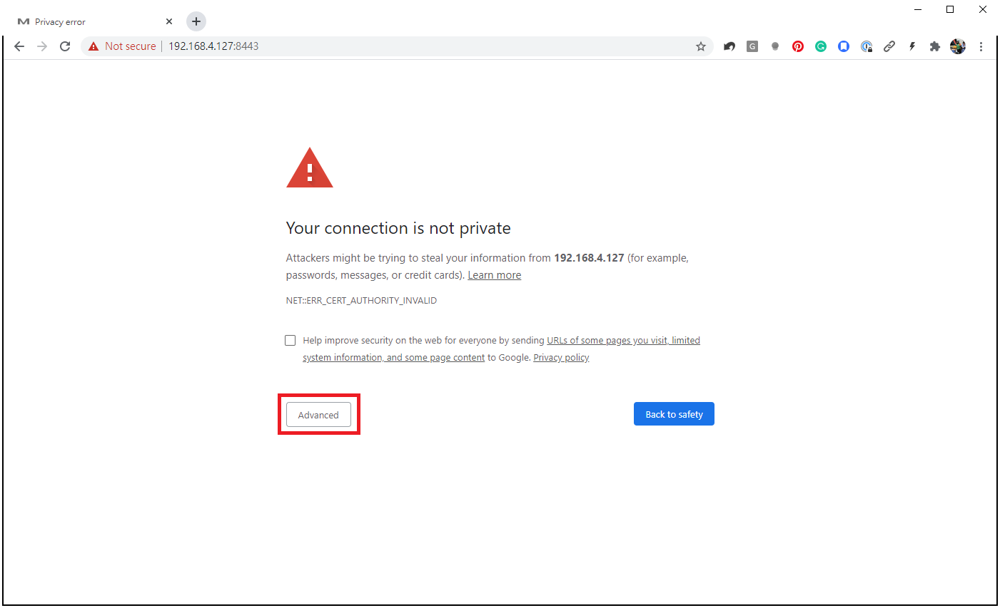
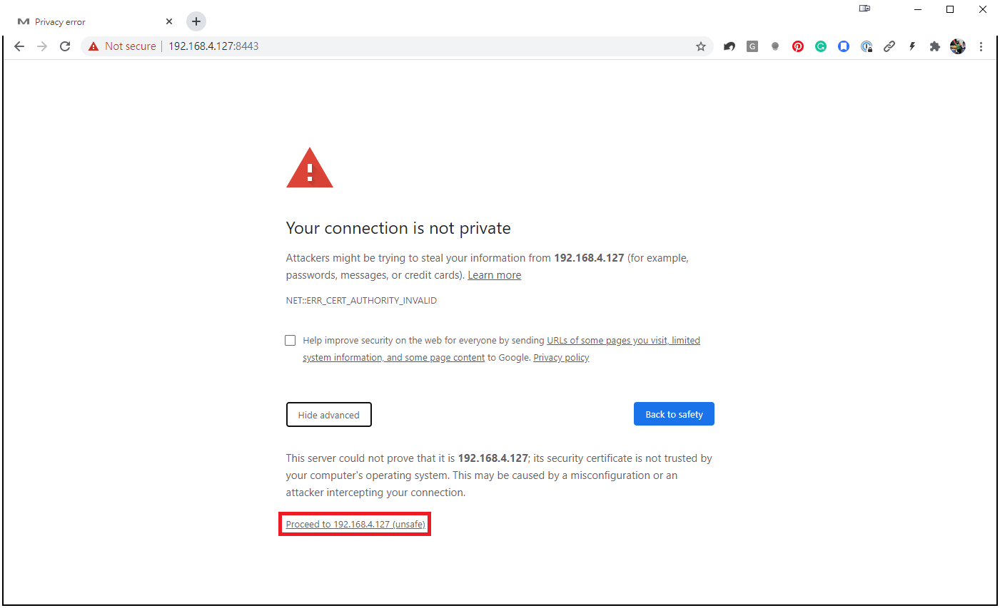
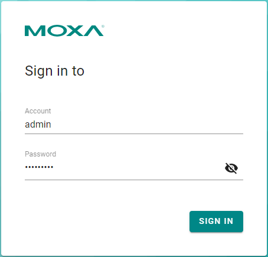

# Device Configuration

To get ThingsPro Edge up and running with the default settings, do the following:

**Note:** We strongly recommend using the <u>Google Chrome</u> browser because the ThingsPro Edge has been tested and verified on this browser.

1. **Launch ThingsPro Edge.**

   **Note:** HTTP has been disabled by default to avoid security risks. The default HTTPS port is **8443** because the Azure IoT Edge uses port 443 as its default.  

   Connect LAN2 to the default IP 192.168.4.127 and enter **`https://192.168.4.127:8443`** in the address bar of the browser. Because the SSL certificate is self-signed by Moxa, you will see a warning message from the browser. Click on the **Advanced** button to proceed.

      

   Then, click on the **<u>Proceed to 192.168.4.127 (unsafe)</u>** link to connect to ThingsPro Edge.

   

   You will see the ThingsPro Edge homepage.

   

   > HTTPS only support TLS 1.2 encryption; ensure that your browser support TLS 1.2.

2. **Login with the default Account & Password.**

   Account: **`admin`**

   Password: **`admin@123`**

   

   **Note:** For security reasons, we suggest changing the default password after the first login.

3. **Configure your system and start transmitting data.**

   - **Overview**: Dashboard to monitor the system and network status
   - **System Configuration**: All system and device configuration settings
   - **Protocol**: Modbus connections settings
   - **Cloud Connectivity**: Data transmission and remote management settings to connect your IIoT Gateway to the cloud
   - **Security**: User access control and role management to restrict access to this IIoT Gateway
   - **Maintenance**: Operation and maintenance tasks such as reboot (the IIoT Gateway), configuration import/export, and the main switch for system services and applications
   - **Diagnostic**: Event logs to help you understand the events on the IIoT gateway and the system log to troubleshoot system issues or to send to Moxa Technical Support.

   