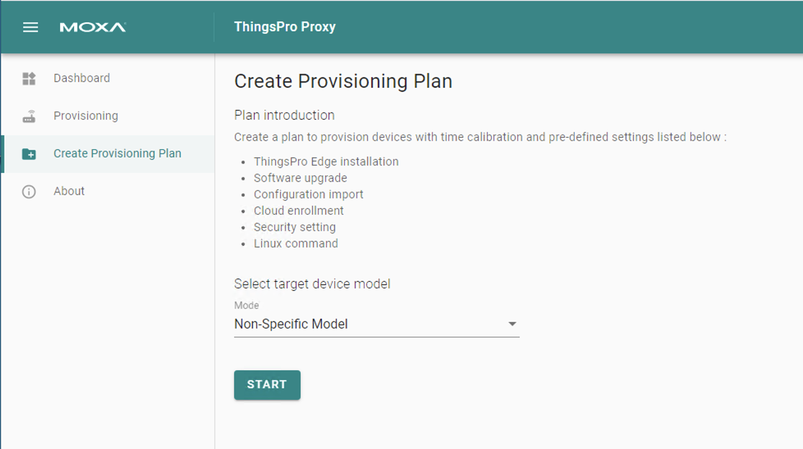
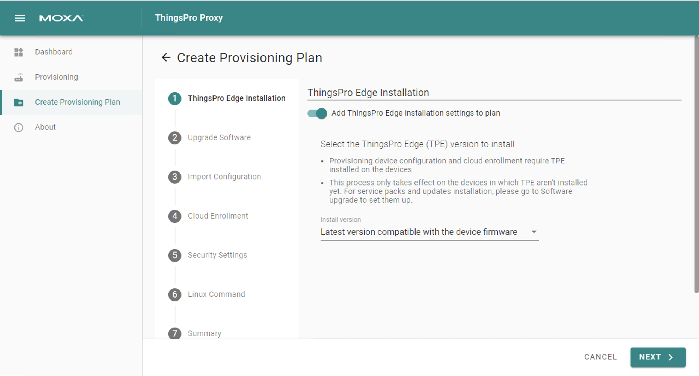
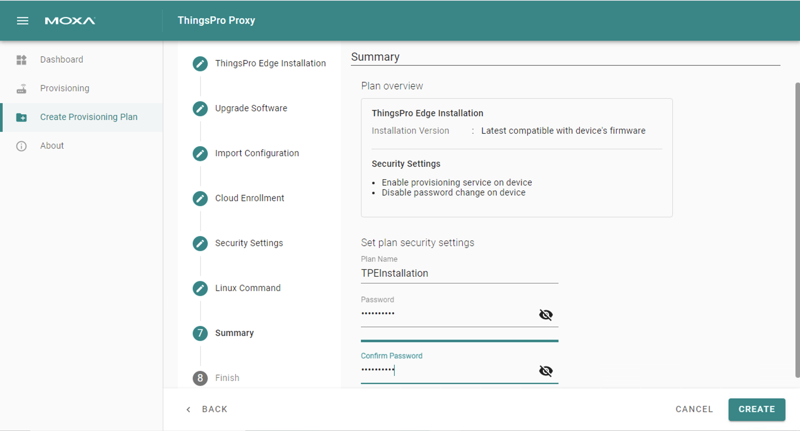
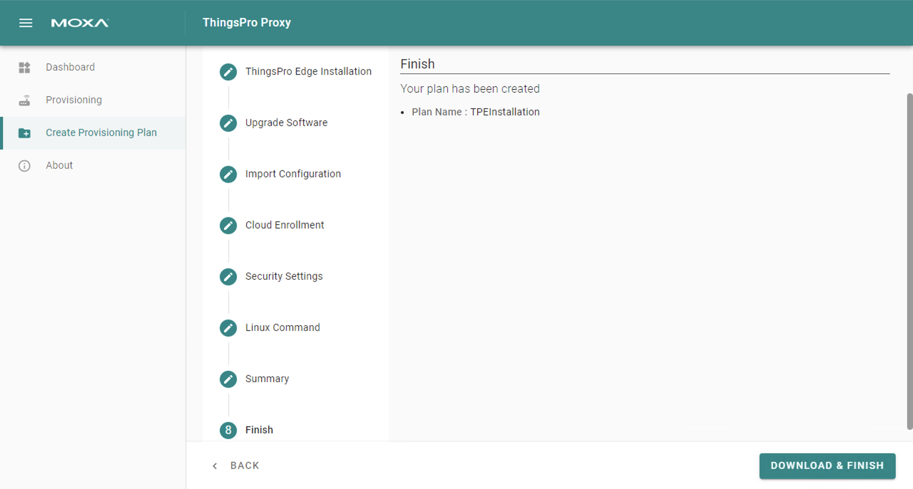
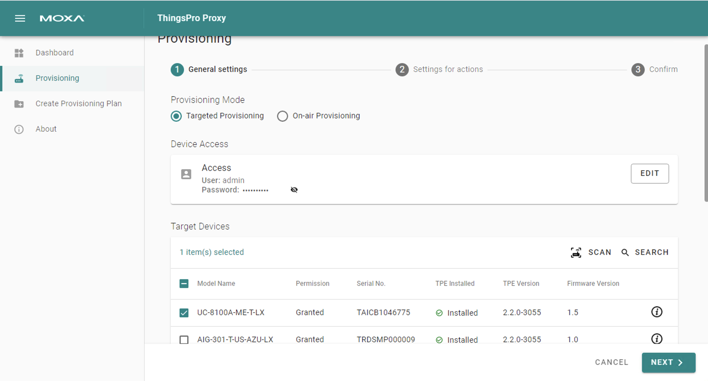
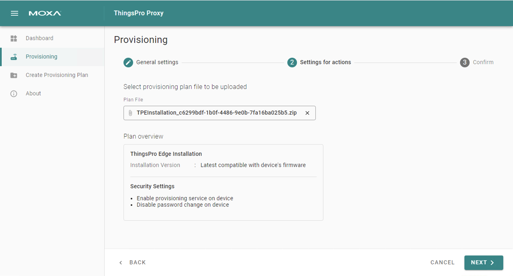
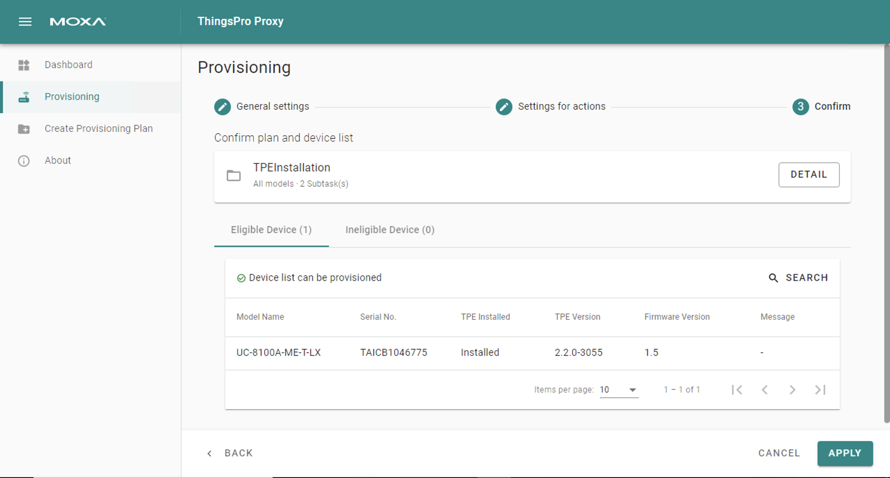

# Installation

### Install ThingsPro Edge from the installer

Find the installer at [official website](https://www.moxa.com/en/products/industrial-computing/system-software/thingspro-edge-series#resources) and install by `dpkg`, be sure to run it with root privilege

```shell
root@Moxa:~# dpkg -i moxa-thingspro-edge-*.deb
...
**********************************************************
* The installation process ended successfully.
**********************************************************
```

You may track the progress by `journalctl -u update -f`

#### Wait built-in APPs installed

When first installing ThingsPro Edge, you have to wait a while for installing built-in APPs, such as API service. You can query progress by

```shell
root@Moxa:~# appman app ls
+---------------+-------------+--------------------------------+---------+
|     NAME      |   VERSION   | STATE (DESIRED STATE)          | HEALTH  |
+---------------+-------------+--------------------------------+---------+
| cloud         | 2.1.0-1013  | ready (ready)                  | good    |
| device        | 2.1.0-3528  | ready (ready)                  | good    |
| edge-web      | 1.9.17-5046 | ready (ready)                  | good    |
| modbusmaster  | 1.3.2-602   | installing (ready) - importing | running |
|               |             | assets...0% (3/4)              |         |
| tagservice    | 2.1.0-575   | ready (ready)                  | good    |
+---------------+-------------+--------------------------------+---------+
```
### Install ThingsPro Edge via ThingsPro Proxy

Find the ThingsPro Proxy (TPP) Utility on [official website](https://www.moxa.com/en/products/industrial-computing/system-software/thingspro-edge-series#resources) and install the ThingPro Edge by a provision plan.

#### Creating a Provision Plan
1. Click on the **Create Provisioning Plan** link.
2. Specify target device model either **Non-Specific Model** or **Specific Model**, and click **START**.


3. Specify the ThingsPro Edge (TPE) installation settings, and click **NEXT**.


4. (Optional) you may define the other settings in the provisioning plan on demand.
5. In the **Summary**, specify a plan name, assign a password, and click **CREATE**.  The password is used to encrypt the plan and then decrypt it before importing the plan.


6. Click **DOWNLOAD & FINISH** to download the plan. The plan will be downloaded as a *.zip file.


7. Click on the **Provisioning** link.
8. Choose the type of provisioning: **Targeted Provisioning** or **On-air Provisioning** and click **SCAN**.
9. Select devices to discover or press **SCAN** to re-scan the LAN for devices. Click **NEXT**.


11. Press **BROWSE...** to select a plan and enter the associated password. Click **NEXT**.


12. Click **APPLY**.
