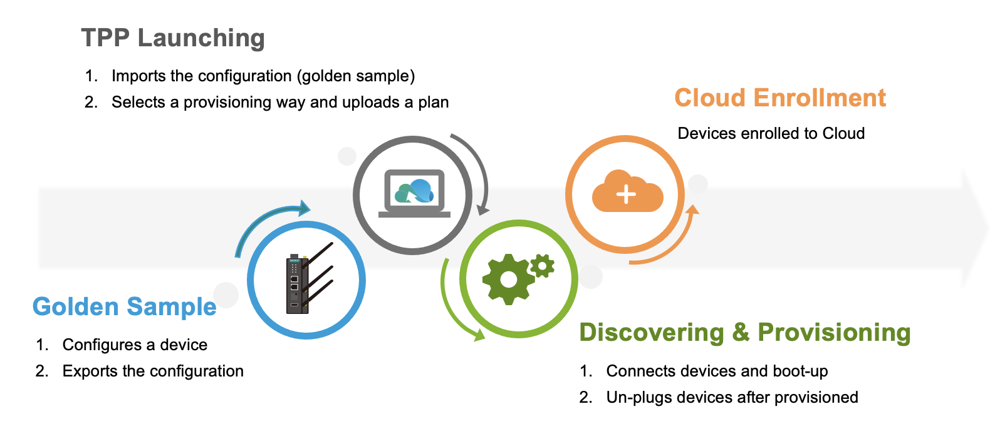

# What Is ThingsPro Proxy?
A new Moxa IIoT gateway must be configured correctly before it can be deployed in the field. Moxa's ThingsPro Proxy utility helps you provision new devices in a secure and scalable manner.

**ThingsPro Proxy (TPP)** is a Windows-based provisioning tool for batch configuring Moxa IIoT gateways based on specific plans. The provisioning plans include details such as device configuration, cloud enrollment information, and security settings. The ThingsPro Proxy plans allow field operators to quickly configure/enroll Moxa devices without requiring domain knowledge and without having to go through complex steps, thereby reducing the cost of operation. The device provisioning tasks can be linked to a configuration plan for quick and effortless provisioning.

